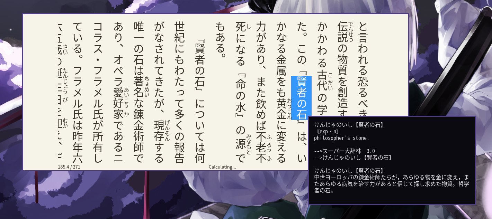

# suckless_dictpopup

This is a very lightweight program to show a popup with the dictionary entry of the selected text. It uses Xlib for displaying the popup and [sdcv](https://github.com/Dushistov/sdcv) for the dictionary lookup.
<br></br>
#### DISCLAIMER: 
That program is intended to be used for reading monolingual dictionaries in *goldendict-ng* , it can serve others purposes, but the main goal is that you don't need to wait years until you complete your monolingual transition.



## Dependencies
notice that most of them might be already installed, they are:

sselp , sdcv, perl

### Currently tested on:
- GNU/Linux 
- FreeBSD


## Setup
First setup [sdcv](https://github.com/Dushistov/sdcv) according to their github page.
Then install with `sudo make install`. \
Uninstall with `sudo make uninstall`

If you would like to automatically lookup a word on every selection (recommended) , then take a look at the following script: <br>  https://github.com/KonstantinDjairo/suckless_dictpopup/blob/main/daemon-popup <br>
<br>
This is not meant to be running all the time, since it looks up everything that goes into the clipboard.\
Disable when using mpvacious for example.


## Usage <br>
Bind to a shortcut <br> \
To add a keyboard shortcut, you can use options of your WM or DE. You can also use sxhkd. \
The popup can be dismissed by clicking on it. 

Here is a snippet from someone's ~/.config/i3/config showing how to bind `dictpopup` to a keyboard shortcut. 
```console
# Run dictpopup
bindsym $mod+c          exec --no-startup-id dictpopup
```

The styling can be changed in `config.h` and then recompile to apply.
There is also a xresources patch from [herbe](https://github.com/dudik/herbe)
that you could try to apply if you like.

`popup` can also be used as a standalone program to show the contents of stdin.


## TODO
- [x] Completed
- [ ] Work in Progress
<br><br/>
- [ ] Switch between words in a given sentence by using the arrow keys or any user-defined key;
      Sudachi can be used to accomplish that.
- [ ] Clipboard watch toggle 
